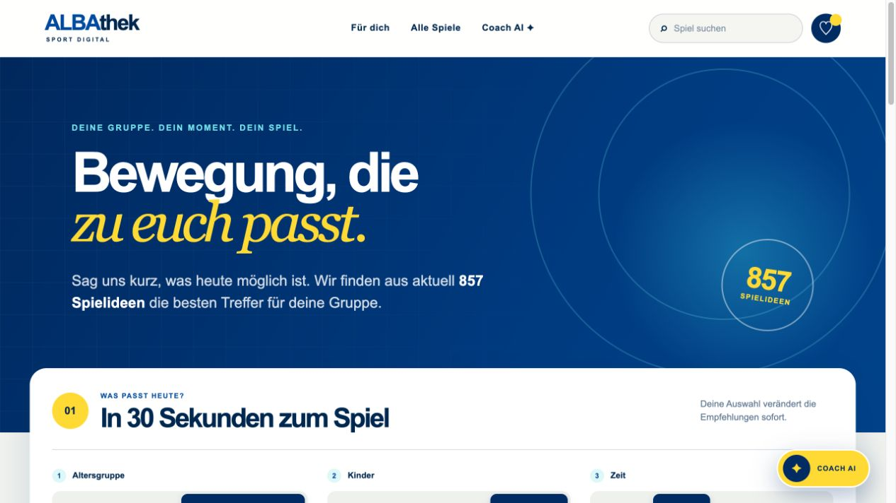
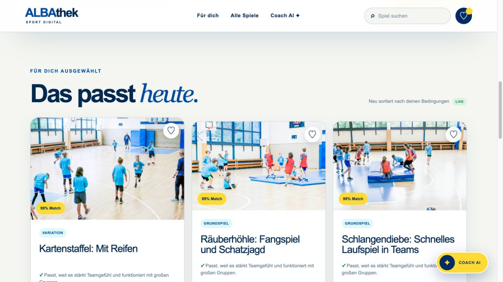
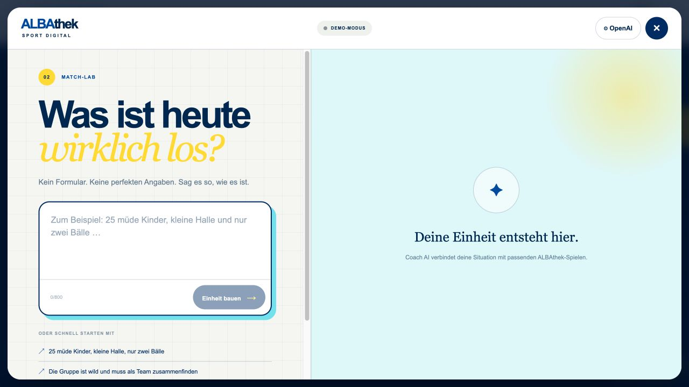
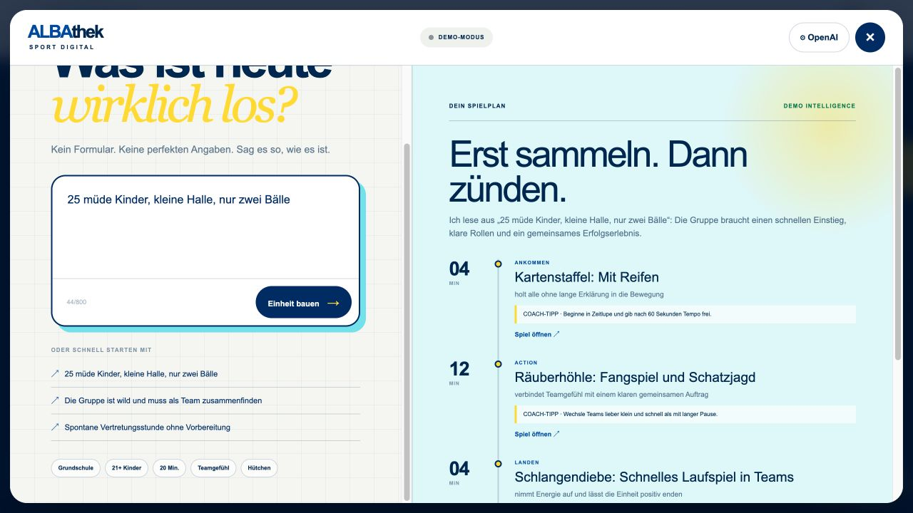
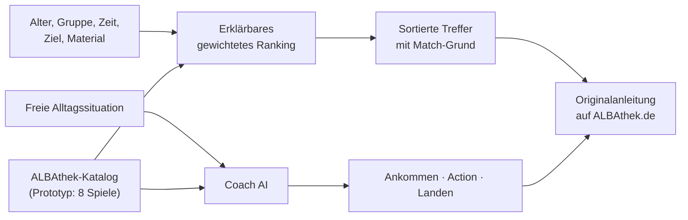

# ALBAthek Match

**Intelligente Spielideen-Empfehlung und Coach AI für ALBAthek**

[Live-Prototyp öffnen](https://albathek-match.dahoooo.chatgpt.site) · [Bewerbungsentwurf](docs/BEWERBUNG.md) · [Projektverlauf](docs/GESPRAECHSVERLAUF.md)

ALBAthek Match macht die große Spielesammlung von ALBA BERLIN in wenigen Sekunden persönlich nutzbar. Menschen, die Sport- und Bewegungsangebote mit Kindern anleiten, geben Alter, Gruppengröße, Zeit, Ziel und vorhandenes Material an. Die Oberfläche priorisiert passende Spiele, erklärt jeden Treffer und führt direkt zur vollständigen Spielanleitung in der ALBAthek.

Der zusätzliche **Coach AI** versteht freie Alltagsschilderungen wie „25 müde Kinder, kleine Halle, nur zwei Bälle“ und baut daraus einen sofort nutzbaren Ablauf aus Ankommen, Action und Landen.

> Status: funktionaler, mobil nutzbarer Prototyp für die Civic-Coding-Challenge 1. Die Oberfläche arbeitet derzeit mit einer kuratierten Stichprobe von acht echten ALBAthek-Spielen. Die produktive Anbindung des vollständigen ALBAthek-Katalogs ist Teil der Übergabe und gemeinsamen Weiterentwicklung mit ALBA BERLIN.

## So fühlt es sich an

### 1. Situation statt Katalog



### 2. Erklärbare, sofort reagierende Empfehlungen



### 3. Freie Eingabe im Coach AI Match-Lab



### 4. Eine komplette, umsetzbare Einheit



## Für Nutzerinnen und Nutzer

1. Rahmenbedingungen auswählen: Kita oder Grundschule, Gruppengröße, Dauer, Ziel und Material.
2. Empfehlungen vergleichen: Die besten Treffer stehen oben und zeigen Match-Wert sowie eine verständliche Begründung.
3. Suchen, merken oder unpassende Ergebnisse ausblenden.
4. Die Originalanleitung des Spiels direkt auf ALBAthek.de öffnen.
5. Optional Coach AI starten, eine Situation frei beschreiben und einen dreiteiligen Ablauf erhalten.

Coach AI funktioniert ohne Einrichtung im **Demo-Modus**. Für eine echte KI-Anfrage kann in den OpenAI-Einstellungen ein eigener API-Key hinterlegt werden. Der Key bleibt im `sessionStorage` des aktuellen Tabs, wird nicht in einer Datenbank des Prototyps gespeichert und kann jederzeit entfernt werden. Live-Anfragen können Kosten im jeweiligen OpenAI-Konto auslösen.

## Was heute funktioniert

- reaktive Personalisierung nach fünf alltagsnahen Kriterien
- gewichtetes Ranking statt harter „kein Treffer“-Filter
- sichtbarer Match-Wert und konkrete Begründung pro Empfehlung
- Volltextsuche, Merkliste im Browser und Ausblenden einzelner Treffer
- Links zu den originalen Spielanleitungen auf ALBAthek.de
- responsive ALBA-nahe Gestaltung für Desktop und Smartphone
- Coach AI mit freier Texteingabe, Demo-Modus und optionalem OpenAI-Live-Modus
- strukturierter KI-Output mit genau drei Phasen und ausschließlich erlaubten Spielen
- keine Registrierung und keine Erfassung von Daten über Kinder

## Lösungslogik



Das regelbasierte Ranking startet mit einem neutralen Grundwert. Passende Merkmale erhöhen den Score mit bewusst nachvollziehbaren Gewichten: Ziel und Altersgruppe zählen stärker als optionale Komfortmerkmale. Dadurch bleibt die Ergebnisliste auch bei ungewöhnlichen Kombinationen hilfreich.

Coach AI sendet Situationsbeschreibung, aktuelle Filterwahl und einen begrenzten Spielkatalog an die OpenAI Responses API. Ein striktes JSON-Schema erzwingt drei Phasen, plausible Zeitwerte und gültige Spiel-IDs. `store: false` verhindert die Speicherung der Response durch die API-Konfiguration. Die KI ergänzt damit die deterministische Suche; sie ersetzt weder die redaktionellen Originalinhalte noch die Entscheidung der anleitenden Person.

## Technische Perspektive

### Stack

- React 19 und TypeScript
- Next.js 16 auf [vinext](https://github.com/cloudflare/vinext)
- Vite und Cloudflare Workers/Sites
- OpenAI Responses API mit Structured Outputs
- CSS ohne UI-Framework; keine Datenbank im Prototyp

### Projektstruktur

```text
app/
  api/coach/route.ts       OpenAI-Proxy und strukturiertes Antwortschema
  components/CoachAI.tsx   Coach-AI-Oberfläche, Settings und Demo-Modus
  page.tsx                 Katalog, Ranking, Suche und Merkliste
  globals.css              ALBA-nahe Gestaltung und Responsive Design
docs/
  BEWERBUNG.md             Ausformulierter Accelerator-Antrag
  GESPRAECHSVERLAUF.md     Sichtbarer Projekt- und Entscheidungsverlauf
  screenshots/             Produktansichten
public/games/              Bilder der kuratierten ALBAthek-Stichprobe
tests/                     automatisierte Produktprüfungen
```

### Lokal starten

Voraussetzung ist Node.js `>=22.13.0`.

```bash
npm install
npm run dev
```

Danach läuft die Anwendung unter `http://localhost:3000`.

```bash
npm run lint
npm test
npm run build
```

Ein OpenAI-Key ist für Entwicklung und Demo nicht erforderlich. Für einen Live-Test: Coach AI öffnen → **OpenAI** → Key und Modell auswählen → **Für diese Sitzung verwenden**.

### API und Datenschutz

`POST /api/coach` akzeptiert:

```json
{
  "prompt": "25 müde Kinder, kleine Halle, nur zwei Bälle",
  "context": {
    "age": "grundschule",
    "size": "gross",
    "duration": 20,
    "goal": "Teamgefühl",
    "material": "Bälle"
  },
  "apiKey": "nur im Request",
  "model": "gpt-5.6-luna"
}
```

Der Endpunkt begrenzt die Eingabe auf 800 Zeichen, erlaubt nur konfigurierte Modelle und fordert per JSON-Schema genau drei Zeitplan-Elemente an. Im aktuellen Bring-your-own-key-Prototyp passiert der Key zwar keinen persistenten Speicher, wird aber über den eigenen Server an OpenAI weitergereicht. Für einen öffentlichen Produktivbetrieb sind deshalb serverseitiges Secret-Management, Authentifizierung, Rate-Limits, Abuse-Schutz, Monitoring und ein belastbares Datenschutzkonzept vorgesehen.

## Übergabe an ALBA BERLIN

Der Prototyp ist bewusst so gebaut, dass der nächste Schritt kein Redesign, sondern eine gemeinsame Integration ist:

- vollständigen Spielkatalog über API, Export oder CMS anbinden
- vorhandene Taxonomie prüfen und fehlende Metadaten redaktionell ergänzen
- Ranking-Gewichte mit Übungsleitenden, Erziehenden und Lehrkräften testen
- Feedbacksignale und datensparsame Erfolgsmetriken definieren
- Coach-Antworten evaluieren, Sicherheits- und Inklusionsleitlinien schärfen
- Barrierefreiheit nach WCAG testen und mit realen Geräten validieren
- Rollen, Betrieb, Hosting, Kostenkontrolle und redaktionelle Verantwortung klären

Erfolg lässt sich beispielsweise über „Zeit bis zur passenden Spielidee“, Öffnungsrate der Originalanleitungen, Merkquote, Abbruchquote und qualitatives Feedback messen — ohne Profile von Kindern anzulegen.

## Grenzen des Prototyps

- Die sichtbare Zahl der gesamten Spielideen stammt aus der bestehenden Plattform; lokal sind aktuell acht Spiele als repräsentative Stichprobe integriert.
- Metadaten und Ranking-Gewichte sind Hypothesen und noch nicht gemeinsam mit ALBA validiert.
- KI-Ausgaben können fehlerhaft sein. Die anleitende Person prüft Eignung, Raum, Material und Sicherheit.
- Es gibt noch keine Nutzerkonten, organisationsweite Favoriten, Analytics oder CMS-Synchronisation.
- Die Live-Demo kann zugriffsbeschränkt sein; der Quellcode und die Screenshots dokumentieren den vollständigen Stand.

## Open Source und Rechte

Der Quellcode wird zur Prüfung und gemeinsamen Weiterentwicklung öffentlich bereitgestellt. Vor Vergabe einer konkreten Open-Source-Lizenz müssen Marken-, Bild- und Inhaltsrechte mit ALBA BERLIN geklärt werden. **ALBA**, **ALBAthek**, die Spieltexte, Links und Bildmotive bleiben Eigentum beziehungsweise Inhalte der jeweiligen Rechteinhaber und sind nicht automatisch von einer späteren Code-Lizenz umfasst.

Dieses Repository ist ein unabhängiger Challenge-Prototyp und derzeit kein offizielles Produkt von ALBA BERLIN.

## Bewerbung

Die vollständig ausformulierten Antworten für den Civic Coding-Accelerator stehen in [docs/BEWERBUNG.md](docs/BEWERBUNG.md). Persönliche Kontaktfelder, Rechtsform, Standort und Einwilligungen bleiben bis zur Bestätigung durch das einreichende Team offen.
