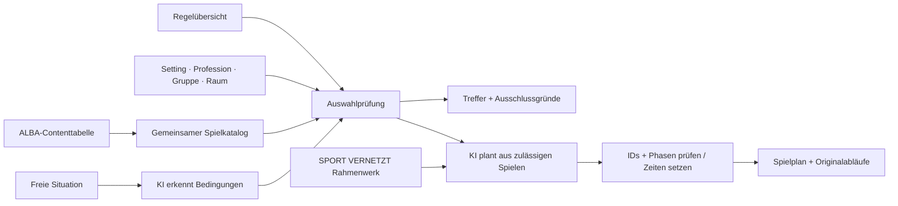

# ALBAthek Match

**Passende Bewegungsspiele für Kita, Grundschule und Verein – mit Coach AI.**

[Bisherige Live-Version](https://albathek-match.dahoooo.chatgpt.site) · [ALBA-Daten & Regelentscheidungen](docs/ALBA-INPUT.md) · [Gesprächsverlauf](docs/GESPRAECHSVERLAUF.md)

## Ausbau mit ALBA-Input · September 2026

Der Katalog enthält **18 Spiele**: zehn neue, detailliert beschriebene Testspiele von ALBA sowie die acht bisher integrierten Spiele. Die neue Auswahl berücksichtigt die Contenttabelle, die Regelübersicht für Kita/Grundschule/Verein und das SPORT-VERNETZT-Rahmenwerk für Coaches.

Die zehn neuen Spiele sind Gartenzwerge, Papprollenangeln, Mäuschen aus dem Haus, Flaschenkegeln, Zauberball mit mehreren Fangkindern, Heiße Kartoffel mit Reifen, Jahreszeitenlauf, Schmuggel-Ei, Osterhase und Krokodil sowie Gespensterparty.

## Für Nutzerinnen und Nutzer

1. Setting und Profession wählen.
2. Jüngstes Alter, Erfahrung der Gruppe, Kinderzahl, Raum und Zeit einstellen.
3. Sportkleidung und gegebenenfalls Bewegungsanlass berücksichtigen.
4. Optional nach Ziel, Material, Vorbereitung, Regeln, Intensität oder Sozialform eingrenzen.
5. Spiel, Thema, Bewegung oder Material suchen und die passende Anleitung direkt öffnen.
6. Spiele merken oder für heute ausblenden. „Warum fehlen Spiele?“ zeigt konkrete Ausschlussgründe.
7. Coach AI öffnen: Situation beschreiben, geprüften Spielplan erhalten, Originalabläufe lesen und den Plan drucken.

Ab 30 Minuten erscheinen die von ALBA angegebenen Jahreskalender beziehungsweise Sport-Mini-Reihen. Die Coach-Hinweise richten sich nach Alter und Setting: Bewegungszeit, Mitspielen, Materialerfahrung, Entscheidungsfreiheit und Reflexion.

### Warum manche Kombinationen keine Spiele liefern

ALBAs Einsteigerregeln verlangen gemeinsam wenige Regeln, minimale Vorbereitung, ein kleines Spiel und die Einstufung „Knaller“. Der aktuelle Zehner-Testkatalog enthält kein Spiel, das alle Kriterien zugleich erfüllt. Die App zeigt diese Datenlücke offen. Für Kita-Gruppen ab 13 Kindern sind nur ausgewiesene Outdoor-Spiele erlaubt; im Kita-Bewegungsraum wird die maximale Hallenkapazität geviertelt.

Die acht bisherigen Spiele bleiben in „Aus der bisherigen Sammlung“ verlinkt. Ihnen fehlen die neuen Metadaten, deshalb werden sie nicht automatisch als passende Planbausteine eingesetzt.

## Coach AI und OpenAI-Einstellungen

Ohne Key funktioniert ein **regelbasierter Offline-Planer**. Er erkennt einfache Angaben zu Anzahl, Alter, Raum und Zeit. Die angezeigte Dauer ergibt exakt die verfügbare Gesamtzeit. Offline wird keine freie KI-Interpretation behauptet.

Für KI-Planung: Coach AI → OpenAI → eigenen API-Key eintragen → für diese Sitzung verwenden. Der Key liegt im Tab-`sessionStorage`, wird bei einer Anfrage an den eigenen Server und von dort an OpenAI gesendet. Die Anwendung speichert ihn nicht in einer Datenbank. Entfernen ist jederzeit möglich. Live-Planungen können zwei kostenpflichtige Modellanfragen auslösen.

Die Live-Planung liest zuerst die Situation, prüft die daraus erkannten Bedingungen erneut gegen ALBAs Regeln und erstellt anschließend einen Plan ausschließlich aus der zulässigen Auswahl. Bei fehlendem Material oder unklaren Mengen fragt sie nach. Rahmenbedingungen und Originalmaterialien stehen beim Ergebnis zur Kontrolle.

## Architektur



- **React 19 / TypeScript**, Next.js auf vinext, Vite, Cloudflare Workers/Sites.
- **Keine Datenbank:** Favoriten sind gerätelokal, OpenAI-Einstellungen sitzungsbezogen.
- **Ein Katalog für Finder und API:** keine auseinanderlaufenden Duplikate.
- **Deterministische Ausschlüsse:** Alter, Raum, Gruppengröße, Profession, Sportkleidung, Anlass und zusätzliche Filter.
- **Priorisierung:** Zielbezug und Vorbereitungsaufwand sortieren innerhalb der passenden Spiele; keine erfundenen Match-Prozentwerte.
- **OpenAI Responses API:** zwei Schritte mit Structured Outputs, `store: false`, Zeitlimits und Fehlerbehandlung.
- **Validierung:** Eingabebereiche, Materialauswahl, gültige Spiel-IDs, kanonische Titel, Phasenfolge und exakte Zeitaufteilung.

### Projektstruktur

```text
app/data/alba-games.json      Zehn ALBA-Spiele mit Originalfeldern und Quellzeilen
app/data/legacy-games.json    Acht bisherige Spiele
app/lib/alba.ts               Gemeinsame Regeln, Suche, Leitlinien und Offline-Plan
app/page.tsx                  Finder, Details, Favoriten, Kalender und Sammlung
app/components/CoachAI.tsx    Coach, Settings und druckbarer Plan
app/api/coach/route.ts        Situationsanalyse und regelgebundene KI-Planung
app/alba.css                  Erweiterung des bestehenden ALBA-Designs
scripts/import-alba.py        Reproduzierbarer, lesender XLSX-Import
tests/product.test.mjs        Ausführbare Regel- und API-Tests
docs/ALBA-INPUT.md            Quellen, offene Punkte und Interpretationen
```

### Lokal starten und prüfen

Node.js >=22.13.0:

```bash
npm install
npm run dev
npm test
npm run lint
```

Die Oberfläche läuft unter http://localhost:3000. Für Demo und Tests ist kein API-Key nötig. Die Tests prüfen die tatsächliche Regel- und API-Logik mit kontrollierten Modellantworten; sie führen keine kostenpflichtigen Live-Anfragen aus.

Der Importer benötigt Python und `openpyxl` und gibt JSON auf stdout aus. Er verändert die Quelldatei nicht. Die verwendeten Dateien und Normalisierungen sind in [ALBA-INPUT.md](docs/ALBA-INPUT.md) beschrieben.

### Grenzen und Übergabe

Die Regelblätter für Grundschule und Verein sind ALBA-Entwürfe. Raumskalierung, nicht mitgelieferte Taxonomie-Anhänge, Materialmengen, Alters-Obergrenzen und die genaue Einheitenstruktur benötigen noch fachlichen Abgleich. Die Dreiteilung und Zeiteinteilung sind Vorschläge des Prototyps. Fehlende Quellwerte bleiben sichtbar.

Ein öffentlicher Produktivbetrieb braucht weiterhin eine vollständige Katalog-/CMS-Anbindung, gemeinsame Tests mit Anleitenden, Betriebskonzept, serverseitige Schlüsselverwaltung und Kostenkontrolle. Die anleitende Person prüft die Eignung der Einheit. Der neue Stand wurde mit simulierten API-Antworten geprüft; ein Live-Test benötigt einen gültigen Key.

### Rechte

Unabhängiger Challenge-Prototyp, kein offizielles Produkt von ALBA BERLIN. Marken, Bilder und redaktionelle Inhalte bleiben den jeweiligen Rechteinhabern zugeordnet. Die bereitgestellten Original-XLSX/PDF-Dateien werden nicht als vollständige Dateien veröffentlicht. Eine Open-Source-Lizenz für den Code ist noch abzustimmen; öffentliche Einsicht allein erteilt keine pauschalen Nutzungsrechte.

## Screenshots des ersten Prototyps · Juli 2026

Diese Ansichten dokumentieren den vorherigen Stand. Der September-Ausbau ersetzt die damalige grobe Filterung und den Demo-Katalog durch die oben beschriebene ALBA-Regellogik.


Der [Bewerbungsentwurf](docs/BEWERBUNG.md) bleibt als historischer Einreichungsstand vom 28.07.2026 erhalten.
