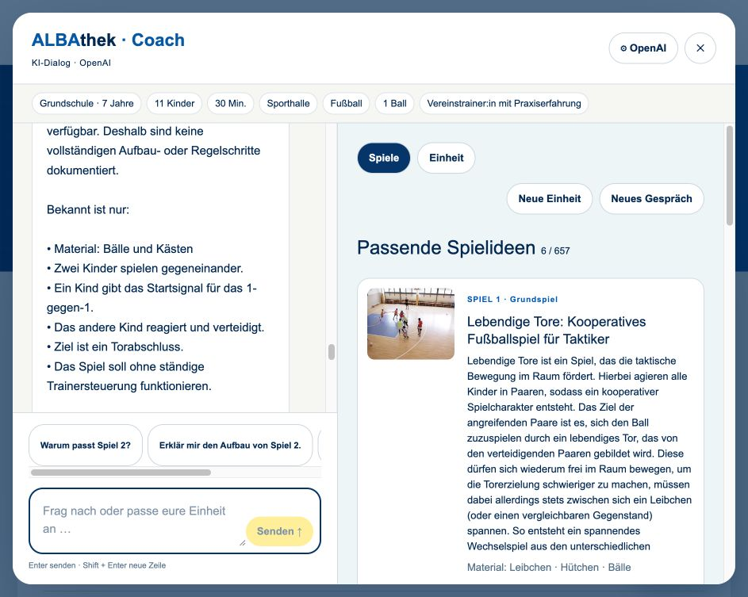
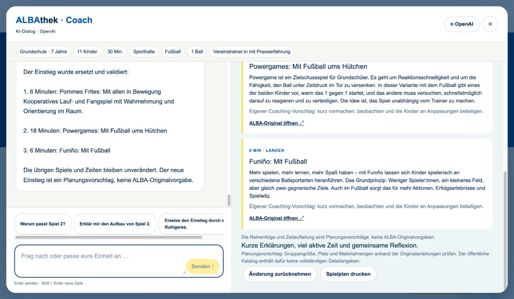

# ALBAthek Match

Bewegungsspiele für Kita, Grundschule und Verein finden – mit optionalem KI-Coach.

[Live-Prototyp](https://albathek-match.dahoooo.chatgpt.site) · [Daten & Regeln](docs/ALBA-INPUT.md) · [Gesprächsverlauf](docs/GESPRAECHSVERLAUF.md)

## Aktueller Stand · 07.09.2026

**657 öffentlich gelistete ALBAthek-Spiele und Variationen** mit Originalbildern, Kurzbeschreibungen und direkten Links. Die bisherigen acht Spiele sind Teil dieses Katalogs. Es handelt sich um einen importierten Stand der öffentlichen [Spieleübersicht](https://albathek.de/filter/32a8ba1b), nicht um eine laufende CMS-Synchronisierung.

Die zehn zusätzlich von ALBA gelieferten **Testprofile** sind separat im „ALBA-Labor“ untergebracht. Neun ergänzen vorhandene öffentliche Spiele; Gespensterparty bleibt ein eigenständiger Testdatensatz. Die experimentelle Detailprüfung ist standardmäßig ausgeschaltet.

## Für Nutzerinnen und Nutzer

1. **Spiele entdecken:** Gesamten Katalog durchsuchen, Grundspiele oder Variationen auswählen und weitere Treffer in 24er-Schritten laden.
2. **Für deine Gruppe:** Kita, Grundschule oder Verein wählen; Alter und Kinderzahl direkt ändern, Zeit und Ort antippen. Ziel, Material und Anleitung liegen unter „Weitere Einstellungen“ beziehungsweise „Ziel, Material & Anleitung einstellen“.
3. **Merken:** Das Herz speichert Spiele lokal auf diesem Gerät. „Gemerkt“ öffnet die Merkliste. Unter Material & Details lassen sich Spiele für heute ausblenden.
4. **Original öffnen:** Bild oder Titel führt zu Video und vollständiger Anleitung bei ALBA. Bilder werden von ALBA geladen; Videos werden nicht kopiert.
5. **ALBA-Coach:** Eine Situation beschreiben, sechs echte Katalogtreffer erhalten, nachfragen und erst auf Wunsch eine Einheit erstellen. Einzelne Abschnitte lassen sich ersetzen und Änderungen zurücknehmen. Ohne API-Key bleiben Basissuche und regelbasierte Planung verfügbar.
6. **ALBA-Labor:** Testprofile lesen und optional zusätzliche Detailregeln ausprobieren. Sie ersetzen weder die öffentliche Sammlung noch eine fachliche Freigabe.

Die öffentliche Sammlung enthält keine vollständigen Angaben zu exakten Altersgrenzen, Gruppenkapazität und Räumen. Treffer sind deshalb **eine Vorauswahl, keine bestätigte Eignungsprüfung**. Prüfe Originalanleitung, Materialmengen, Platz und Gruppe selbst. Für längere Angebote werden ALBAs Jahreskalender bzw. Mini-Reihen verlinkt.

### OpenAI einrichten

Coach AI → OpenAI → eigenen API-Key eintragen → Speichern. Der Key liegt ausschließlich im `sessionStorage` der Browsersitzung, geht bei einer Anfrage an den eigenen Server und von dort an OpenAI. Er wird nicht in einer Datenbank oder in Anwendungslogs gespeichert. Entfernen ist jederzeit möglich. Bitte keine personenbezogenen Daten von Kindern eingeben.

Der Coach behält Gespräch, Gruppendaten, Treffer und Planstände innerhalb derselben Sitzung. Schließen und Neuladen erhalten diesen Zustand; „Neues Gespräch“ löscht ihn nach Bestätigung. „Neue Einheit“ leert nur den Plan. Der Chat lässt sich abbrechen und wiederholen. Bei Fehlern bleiben Treffer und der letzte gültige Plan erhalten.

Die tatsächliche KI-Antwortzeit hängt vom gewählten Modell, benötigten Katalogfunktionen und OpenAI ab. Ohne gültigen Key wird kein KI-Dialog vorgetäuscht: Die Oberfläche kennzeichnet die regelbasierte Hilfe ausdrücklich.

## Technische Perspektive

React 19 / TypeScript, Next.js auf vinext/Vite und Cloudflare Workers/Sites. Keine Datenbank: Merkliste gerätelokal, OpenAI-Einstellungen sitzungsbezogen.

### Datenfluss

```text
Nachricht + verbindliche Gruppendaten + aktueller Plan
                         ↓
 Responses API (`store: false`, vollständige letzte 12 Runden)
                         ↓
          search_games · read_game · propose_plan
                         ↓
 Anwendung durchsucht 657 Einträge / liest nur geprüfte ALBA-Links
                         ↓
 Validierung von IDs, Materialwidersprüchen, Familien, Dauer und Änderungstiefe
                         ↓
 Textantwort + sechs Treffer oder atomar übernommene Planversion

ALBA-Testprofile → optionales Labor → zusätzliche Detailprüfung für 9 zugeordnete Spiele
SPORT VERNETZT → pädagogische Hinweise für Sofortplan und KI
```

- Suche über Titel, Kurzbeschreibung und Material; Titelübereinstimmungen werden bevorzugt.
- Grundspiele und schnell vorbereitete Angebote erhalten einen Ranking-Vorteil; Zielbezug priorisiert. Keine erfundenen Match-Prozentwerte.
- Spiel-Familien werden über den Original-URL-Pfad erkannt. Weder dieselbe ID noch eine weitere Variante derselben Familie darf zweimal im Plan stehen.
- Die KI erhält Funktionen statt eines unkontrollierten Katalog-Dumps. Funktionsargumente sind strikt typisiert; Ergebnisse werden lokal ausgeführt und validiert.
- Gesprächskontext wird mit der Responses API manuell weitergegeben; `store: false` bleibt aktiv. Vollständige Antwort- und Werkzeugschritte werden paarweise erhalten, auf zwölf Runden begrenzt und durch strukturierte Gruppendaten ergänzt.
- Pro Nachricht sind höchstens zwei Werkzeugrunden zulässig. Eine einfache Rückfrage nutzt bestehende Referenzen; eine Aufbaufrage darf ausschließlich einen bereits angezeigten, geprüften ALBAthek-Link lesen.
- Planänderungen werden erst nach vollständiger Validierung atomar übernommen. Erklärungsfragen dürfen den Plan nicht verändern. Gezielter Ersatz erhält andere Abschnitte und Zeiten; Wiederholungen sind nur auf ausdrücklichen Wunsch erlaubt.
- Antworttext wird gestreamt. Abbruch, Zeitüberschreitung und OpenAI-Fehler verwerfen keinen gültigen Zustand. Nur Authentifizierungsfehler verweisen auf die Einstellungen.
- Zeitaufteilung Ankommen/Action/Landen ist ein Vorschlag des Prototyps, keine offizielle ALBA-Systematik.
- Fehlende Quelldaten werden nicht als bestätigte Eignung ausgegeben.

### Projektstruktur

```text
app/data/public-games.json    657 öffentliche Spiele, Metadaten und Quellen
app/data/alba-games.json      10 separat angelieferte ALBA-Testprofile
app/data/legacy-games.json    Historischer Acht-Spiele-Stand (nicht doppelt angezeigt)
app/lib/catalog.ts           Öffentliche Suche und Profilzuordnung
app/lib/alba.ts               Experimentelle Detailregeln und Rahmenwerk-Leitlinien
app/lib/coach.ts              Gesprächszustand, lokale Suche, Planversionen und Validierung
app/lib/coach-source.ts       Begrenzter Abruf geprüfter ALBAthek-Originalanleitungen
app/page.tsx                  Katalog, kompakte Filter, Merkliste und ALBA-Labor
app/components/CoachAI.tsx    Dialog, Arbeitsbereich, Einstellungen und Druckansicht
app/api/coach/route.ts        Streaming-Dialog und OpenAI Function Calling
scripts/scrape-albathek.mjs   Import der öffentlichen Übersicht und Spielmetadaten
scripts/import-alba.py        Lesender XLSX-Import
tests/*.test.mjs              26 Regel-, Katalog-, Dialog-, Quellen- und API-Tests
```

### Lokal starten

Node.js >= 22.13.0:

```bash
npm install
npm run dev
npm test
npm run lint
```

Die Oberfläche läuft unter http://localhost:3000. Automatisierte API-Tests verwenden kontrollierte Modellantworten, keine API-Credits. Der Produktionsbuild, Lint und 26 Verhaltenstests sind erfolgreich. Zusätzlich wurde ein echter OpenAI-Mehrschritt-Dialog von der Fußballsuche bis zu Plan, Erklärung, gezieltem Ersatz und Rückgängig geprüft; gemessene Antwortzeiten lagen in diesem Lauf bei rund 16–28 Sekunden. Das ist eine Momentaufnahme, keine Leistungszusage.

Ein eigenständiges `tsc --noEmit` meldet weiterhin fehlende Cloudflare-Umgebungstypen in den unveränderten Starterdateien `db/index.ts` und `worker/index.ts`; der vinext-Produktionsbuild funktioniert.

### Katalog aktualisieren

Die öffentliche Übersicht als HTML lokal speichern, dann:

```bash
node scripts/scrape-albathek.mjs /pfad/zur/spieleuebersicht.html --details
```

Der Importer liest alle gefundenen Spielkarten, lädt öffentliche Kurzbeschreibungen und Materialangaben mit vier begrenzten Arbeitsläufen und schreibt den erzeugten Datensatz erst nach erfolgreichem vollständigem Abruf. Keine Anmeldung, keine Videos, keine geschützten Inhalte. Strukturänderungen der ALBA-Seiten erfordern einen geprüften Importer-Abgleich. Aktualisierungsdatum und erwartete Katalogzahl in Dokumentation/Tests nach einem neuen Import anpassen.

Die XLSX-Verarbeitung benötigt Python mit `openpyxl`; die Originaldateien bleiben unverändert. Weitere Quellen und fachliche Interpretationen stehen in [ALBA-INPUT.md](docs/ALBA-INPUT.md).

## Screenshots · korrigierter September-Stand





[Mobiler Coach](docs/screenshots/11-coach-mobile.png). Die Aufnahmen 01–08 im selben Ordner dokumentieren frühere Entwicklungsstände.

## Übergabe, Betrieb und Rechte

Für den Produktivbetrieb: mit ALBA abgestimmte CMS-Anbindung und Nutzungsrechte, fachlich validierte Metadaten, Nutzertests, Barrierefreiheitsprüfung, Betriebskonzept, Schlüsselverwaltung und Kostenkontrolle. Ein öffentlicher GitHub-Codebestand macht die private Live-Site nicht automatisch öffentlich.

Unabhängiger Challenge-Prototyp, kein offizielles Produkt von ALBA BERLIN. Marken, Bilder und redaktionelle Inhalte bleiben bei den Rechteinhabern. Die Original-XLSX/PDF-Dateien werden nicht als vollständige Dateien veröffentlicht. Eine Open-Source-Lizenz für den Code ist noch abzustimmen; öffentliche Einsicht allein erteilt keine pauschalen Nutzungsrechte.

Der [Bewerbungsentwurf](docs/BEWERBUNG.md) bleibt historischer Einreichungsstand vom 28.07.2026. Persönliche Pflichtfelder und Einwilligungen wurden nicht erfunden; das Formular wurde nicht abgeschickt.
