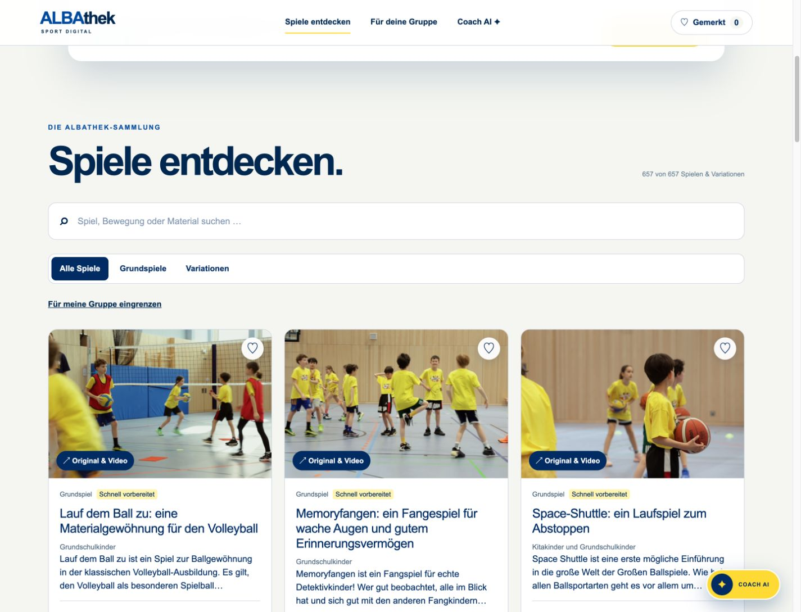
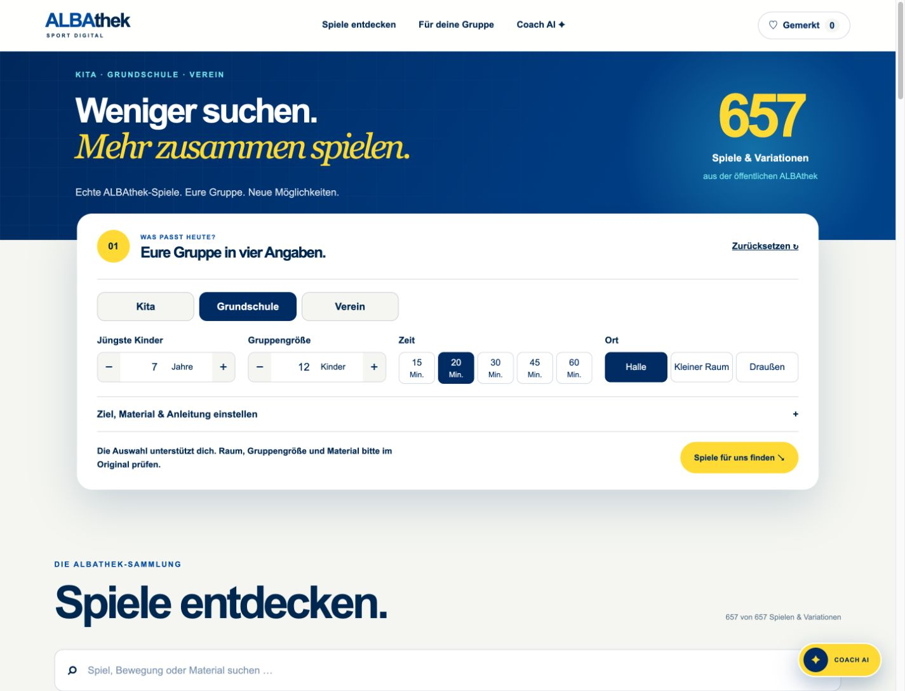
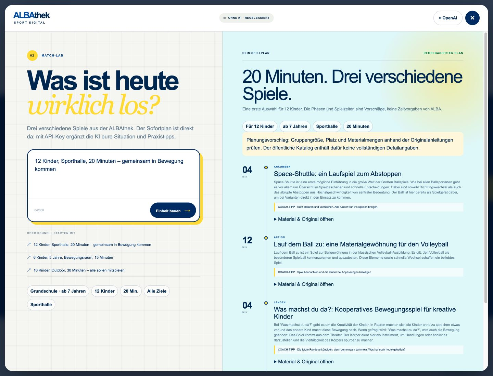

# ALBAthek Match

Bewegungsspiele für Kita, Grundschule und Verein finden – mit optionalem KI-Coach.

[Live-Prototyp](https://albathek-match.dahoooo.chatgpt.site) · [Daten & Regeln](docs/ALBA-INPUT.md) · [Gesprächsverlauf](docs/GESPRAECHSVERLAUF.md)

## Aktueller Stand · 07.09.2026

**657 öffentlich gelistete ALBAthek-Spiele und Variationen** mit Originalbildern, Kurzbeschreibungen und direkten Links. Die bisherigen acht Spiele sind Teil dieses Katalogs. Es handelt sich um einen importierten Stand der öffentlichen [Spieleübersicht](https://albathek.de/filter/32a8ba1b), nicht um eine laufende CMS-Synchronisierung.

Die zehn zusätzlich von ALBA gelieferten **Testprofile** sind separat im „ALBA-Labor“ untergebracht. Neun ergänzen vorhandene öffentliche Spiele; Gespensterparty bleibt ein eigenständiger Testdatensatz. Die experimentelle Detailprüfung ist standardmäßig ausgeschaltet.

## Für Nutzerinnen und Nutzer

1. **Spiele entdecken:** Gesamten Katalog durchsuchen, Grundspiele oder Variationen auswählen und weitere Treffer in 24er-Schritten laden.
2. **Für deine Gruppe:** Kita, Grundschule oder Verein wählen; Alter und Kinderzahl direkt ändern, Zeit und Ort antippen. Ziel, Material und Anleitung liegen unter „Weitere Einstellungen“ beziehungsweise „Ziel, Material & Anleitung einstellen“.
3. **Merken:** Das Herz speichert Spiele lokal auf diesem Gerät. „Gemerkt“ öffnet die Merkliste. Unter Material & Details lassen sich Spiele für heute ausblenden.
4. **Original öffnen:** Bild oder Titel führt zu Video und vollständiger Anleitung bei ALBA. Bilder werden von ALBA geladen; Videos werden nicht kopiert.
5. **Coach AI:** Situation beschreiben und eine Einheit mit drei unterschiedlichen Spielfamilien erstellen. Der regelbasierte Sofortplan braucht keinen API-Key. Pläne lassen sich drucken.
6. **ALBA-Labor:** Testprofile lesen und optional zusätzliche Detailregeln ausprobieren. Sie ersetzen weder die öffentliche Sammlung noch eine fachliche Freigabe.

Die öffentliche Sammlung enthält keine vollständigen Angaben zu exakten Altersgrenzen, Gruppenkapazität und Räumen. Treffer sind deshalb **eine Vorauswahl, keine bestätigte Eignungsprüfung**. Prüfe Originalanleitung, Materialmengen, Platz und Gruppe selbst. Für längere Angebote werden ALBAs Jahreskalender bzw. Mini-Reihen verlinkt.

### OpenAI einrichten

Coach AI → OpenAI → eigenen API-Key eintragen → für diese Sitzung verwenden. Der Key liegt ausschließlich im Tab-`sessionStorage`, geht bei einer Anfrage an den eigenen Server und von dort an OpenAI. Er wird nicht in einer Datenbank gespeichert. Entfernen ist jederzeit möglich.

Pro Live-Plan erfolgt **ein** kostenpflichtiger Aufruf der Responses API statt zuvor zwei aufeinanderfolgender Aufrufe. Währenddessen erscheint, soweit die Angaben lokal verarbeitbar sind, schon ein eindeutig markierter Sofortvorschlag. Die KI lässt sich abbrechen. Spezielle Materialmengen oder unklare Anforderungen können eine Rückfrage auslösen.

Die tatsächliche KI-Antwortzeit hängt weiterhin vom gewählten Modell und OpenAI ab; es gibt keine garantierte Sekundenangabe. Ohne gültigen Key ist der Sofortplan vollständig nutzbar.

## Technische Perspektive

React 19 / TypeScript, Next.js auf vinext/Vite und Cloudflare Workers/Sites. Keine Datenbank: Merkliste gerätelokal, OpenAI-Einstellungen sitzungsbezogen.

### Datenfluss

```text
Öffentliche ALBAthek → versionierter Katalog mit 657 Einträgen
                                     ↓
Suche + vorhandene Metadaten → Vorauswahl → bis zu 18 unterschiedliche Spielfamilien
                                     ↓
                             Sofortplan (lokal)
                                     ↓
                          ein optionaler KI-Aufruf
                                     ↓
                   Bedingungen, IDs, Familien & Phasen prüfen
                                     ↓
                     drei Spiele, kanonische Titel, exakte Minuten

ALBA-Testprofile → optionales Labor → zusätzliche Detailprüfung für 9 zugeordnete Spiele
SPORT VERNETZT → pädagogische Hinweise für Sofortplan und KI
```

- Suche über Titel, Kurzbeschreibung und Material; Titelübereinstimmungen werden bevorzugt.
- Grundspiele und schnell vorbereitete Angebote erhalten einen Ranking-Vorteil; Zielbezug priorisiert. Keine erfundenen Match-Prozentwerte.
- Spiel-Familien werden über den Original-URL-Pfad erkannt. Weder dieselbe ID noch eine weitere Variante derselben Familie darf zweimal im Plan stehen.
- Die KI erhält nur eine begrenzte Auswahl, keine 657 vollständigen Datensätze.
- Structured Outputs, `store: false`, maximal 2.200 Ausgabetokens, serverseitiges Zeitlimit und Abbruchsignal.
- Die KI interpretiert Bedingungen und plant in einem Aufruf; erkannte Änderungen werden danach erneut geprüft.
- Kanonische Titel und Zeitanteile werden im Server gesetzt. Nicht passende oder doppelte Antworten werden mit einer Meldung abgewiesen, nicht still repariert.
- Zeitaufteilung Ankommen/Action/Landen ist ein Vorschlag des Prototyps, keine offizielle ALBA-Systematik.
- Fehlende Quelldaten werden nicht als bestätigte Eignung ausgegeben.

### Projektstruktur

```text
app/data/public-games.json    657 öffentliche Spiele, Metadaten und Quellen
app/data/alba-games.json      10 separat angelieferte ALBA-Testprofile
app/data/legacy-games.json    Historischer Acht-Spiele-Stand (nicht doppelt angezeigt)
app/lib/catalog.ts           Öffentliche Suche, Profilzuordnung, Planer und Validierung
app/lib/alba.ts               Experimentelle Detailregeln und Rahmenwerk-Leitlinien
app/page.tsx                  Katalog, kompakte Filter, Merkliste und ALBA-Labor
app/components/CoachAI.tsx    Coach, Einstellungen, Sofortvorschlag und Druckansicht
app/api/coach/route.ts        Ein KI-Aufruf mit anschließender Validierung
scripts/scrape-albathek.mjs   Import der öffentlichen Übersicht und Spielmetadaten
scripts/import-alba.py        Lesender XLSX-Import
tests/product.test.mjs        Regel-, Katalog- und API-Tests
```

### Lokal starten

Node.js >= 22.13.0:

```bash
npm install
npm run dev
npm test
npm run lint
```

Die Oberfläche läuft unter http://localhost:3000. Tests verwenden kontrollierte Modellantworten, keine API-Credits. Der Produktionsbuild und 19 Verhaltenstests sind erfolgreich. Im Browser wurden Navigation, Originalbilder, Gagaball-Suche, Merkliste und ein Sofortplan geprüft. Ein echter OpenAI-Latenztest ist nicht Bestandteil dieses Prüfstands.

Ein eigenständiges `tsc --noEmit` meldet weiterhin fehlende Cloudflare-Umgebungstypen in den unveränderten Starterdateien `db/index.ts` und `worker/index.ts`; der vinext-Produktionsbuild funktioniert.

### Katalog aktualisieren

Die öffentliche Übersicht als HTML lokal speichern, dann:

```bash
node scripts/scrape-albathek.mjs /pfad/zur/spieleuebersicht.html --details
```

Der Importer liest alle gefundenen Spielkarten, lädt öffentliche Kurzbeschreibungen und Materialangaben mit vier begrenzten Arbeitsläufen und schreibt den erzeugten Datensatz erst nach erfolgreichem vollständigem Abruf. Keine Anmeldung, keine Videos, keine geschützten Inhalte. Strukturänderungen der ALBA-Seiten erfordern einen geprüften Importer-Abgleich. Aktualisierungsdatum und erwartete Katalogzahl in Dokumentation/Tests nach einem neuen Import anpassen.

Die XLSX-Verarbeitung benötigt Python mit `openpyxl`; die Originaldateien bleiben unverändert. Weitere Quellen und fachliche Interpretationen stehen in [ALBA-INPUT.md](docs/ALBA-INPUT.md).

## Screenshots · korrigierter September-Stand





[Mobile Navigation](docs/screenshots/05-mobile-navigation.png). Die Aufnahmen 01–04 im selben Ordner dokumentieren den historischen Juli-Prototyp.

## Übergabe, Betrieb und Rechte

Für den Produktivbetrieb: mit ALBA abgestimmte CMS-Anbindung und Nutzungsrechte, fachlich validierte Metadaten, Nutzertests, Barrierefreiheitsprüfung, Betriebskonzept, Schlüsselverwaltung und Kostenkontrolle. Ein öffentlicher GitHub-Codebestand macht die private Live-Site nicht automatisch öffentlich.

Unabhängiger Challenge-Prototyp, kein offizielles Produkt von ALBA BERLIN. Marken, Bilder und redaktionelle Inhalte bleiben bei den Rechteinhabern. Die Original-XLSX/PDF-Dateien werden nicht als vollständige Dateien veröffentlicht. Eine Open-Source-Lizenz für den Code ist noch abzustimmen; öffentliche Einsicht allein erteilt keine pauschalen Nutzungsrechte.

Der [Bewerbungsentwurf](docs/BEWERBUNG.md) bleibt historischer Einreichungsstand vom 28.07.2026. Persönliche Pflichtfelder und Einwilligungen wurden nicht erfunden; das Formular wurde nicht abgeschickt.
