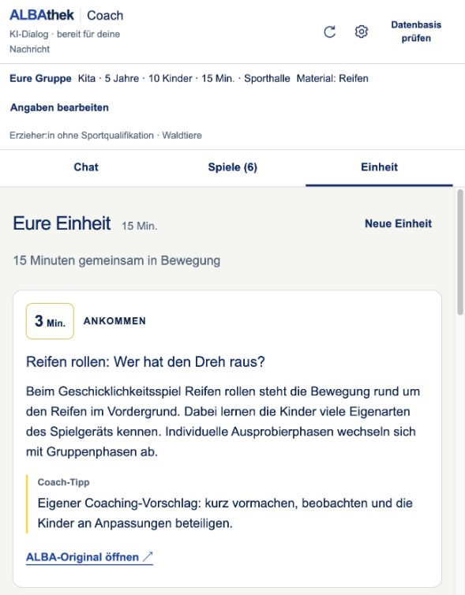

# Live-Nachtest des KITA-Coachs

23.09.2026 · lokaler Coach mit vorhandenem OpenAI-Schlüssel, Modell gpt-5.6-luna. Keine Schlüssel ausgelesen oder protokolliert. Bestehende Sitzung weiterverwendet.

## Geprüfte Gesprächsschritte

| Schritt | Beobachtung |
| --- | --- |
| Aufbau von Spiel 2 der bestehenden Einheit erklären | „Kartonwald“ korrekt erklärt; Schritte mit Tabelle abgeglichen; Plan unverändert. |
| „Wir haben doch nur 15 Minuten“ | Gruppendauer aktualisiert; bestehender 30-Minuten-Plan unverändert. Neue Dauerwarnung nach Laden des aktuellen Frontends sichtbar. |
| Bestehende Einheit auf 15 Minuten verkürzen, Spiele behalten | Gleiche drei Spiele in gleicher Reihenfolge, Zeiten von 6/18/6 auf 3/9/3 Minuten geändert. |
| Einzelspiele ohne Reifen | Sechs Treffer, bestehender Plan unverändert. Fehlende Materialdaten werden offengelegt. |
| „Wir haben jetzt doch Reifen. Zeig uns Spiele mit Reifen.“ | Neuer Wunsch überschreibt den alten Ausschluss; sechs Reifen-Spiele und synchronisierte Materialanzeige. |
| Spiel 2 aus neuen Treffern erklären, während eine Einheit existiert | Fehler reproduziert: Modell benennt „Trommellauf“, interner Referenzcheck zeigt jedoch auf das zweite Planspiel; Originalabruf wird abgelehnt. |
| Exakt dieselbe Rückfrage nach Korrektur | „Trommellauf“ mit fünf Originalschritten erfolgreich erklärt; keine Planänderung. |
| Reifenmenge für Spiel 2 bei zehn Kindern | Nach Präzisierung der Quellenhinweise: zehn Reifen, begründet mit „für jedes Kind einen Reifen“ aus dem Ablauf. |
| Neue freie Einheit mit Reifen, 15 Minuten | Validierter Plan mit Reifen rollen / Trommellauf / Heiße Kartoffel, 3/9/3 Minuten, automatische Anzeige der Einheit. Kein zusätzlicher verworfener Modellaufruf nach der Planprüfung. |
| „Warum passt Spiel 2 der Einheit?“ nach optimierter Planung | Antwort bezieht sich auf Trommellauf und die aktuelle Gruppe; neun Minuten werden als eigener Planungsvorschlag bezeichnet. Gesprächsfortsetzung ohne Provider-/Verlaufsfehler. |

## Korrekturen

- Leerzeichen in der Erkennung von „Spiele mit …“ repariert; passende alte Materialausschlüsse werden aufgehoben.
- Zeitabweichung zwischen Gruppendaten und bestehendem Plan wird sichtbar, ohne ungefragte Planänderung.
- Explizite Treffer- und Planreferenzen werden getrennt. Bei unqualifizierten Spielnummern ist die zuletzt gezeigte Suche bzw. Planerstellung maßgeblich. Planbezogene Anschlussfragen heißen nun „Hauptteil erklären“ und nennen im gesendeten Text ausdrücklich die Einheit.
- Mengenfragen werden als Nachfragen behandelt und lesen die Originalquelle. Quellenhinweise verlangen, Mengenregeln auch im Ablauf zu berücksichtigen, nicht nur in der Materialspalte.
- Nach validiertem Plan werden alle Werkzeugantworten vollständig gespeichert; der bisher zusätzliche, anschließend verworfene Modelltext wird nicht mehr angefordert. Normaler Planpfad: zwei statt drei Modellanfragen. Keine Aussage über garantierte Antwortzeiten.

## Abnahme und Grenzen

48 automatisierte Tests erfolgreich; Lint und TypeScript-Prüfung erfolgreich. Reale Dialoge ergänzen diese Tests, ersetzen aber keine fachliche Abnahme. Vor der Mengenpräzisierung enthielt eine Antwort den widersprüchlichen Hinweis „Menge nicht angegeben“, obwohl der anschließend zitierte Ablauf einen Reifen je Kind verlangt. Die erneute Mengenfrage wurde korrekt beantwortet; KI-Texte bleiben prüfpflichtig.

Die vorhandenen vier Personas und 129 KITA-Einträge bleiben unverändert. Unklare ALBA-Kettenregeln bleiben deaktiviert. Die neue Referenzlogik deckt explizite Treffer-/Einheitenbezüge ab, nicht jede denkbare mehrdeutige Formulierung.

