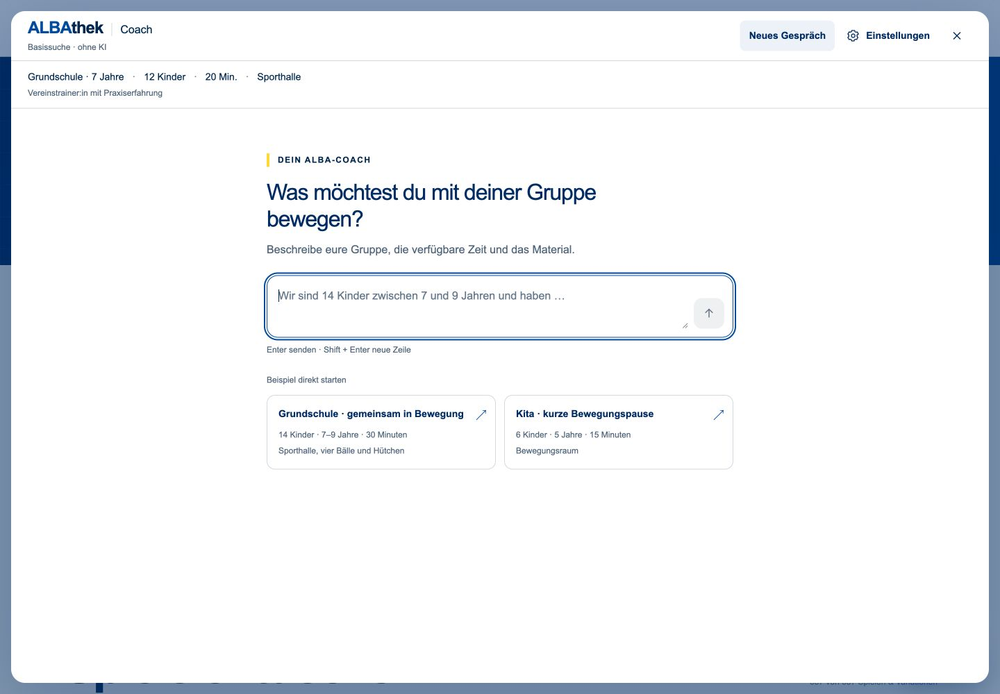
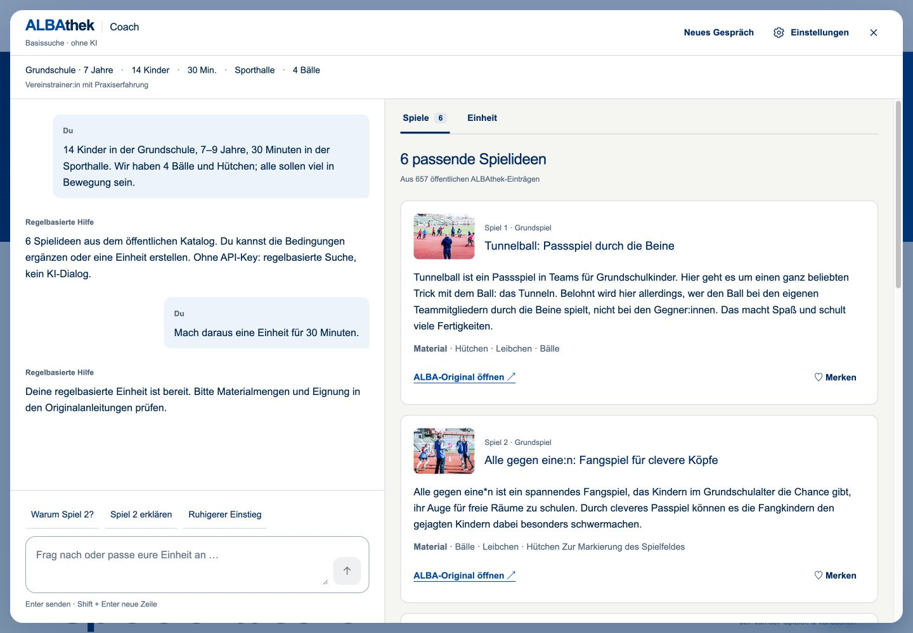
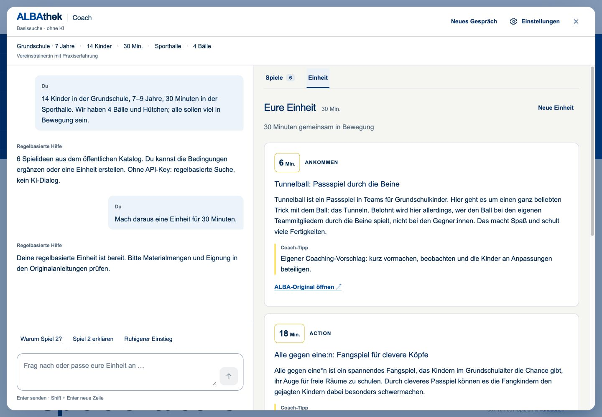
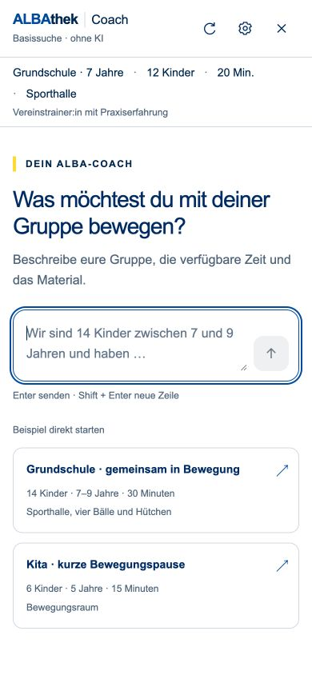
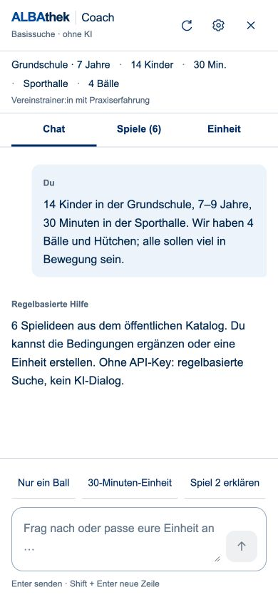
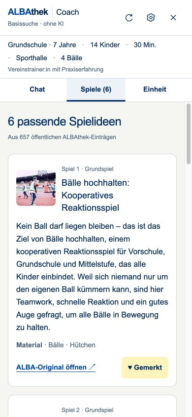
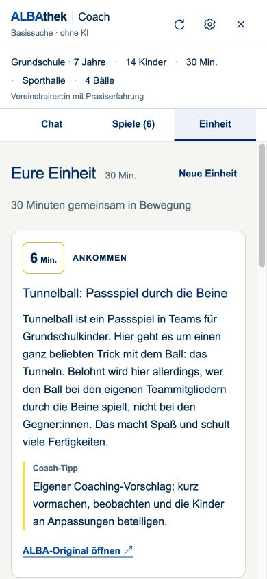

# Coach-Frontend: Dialog zuerst

Stand: 7. September 2026. Lokale Umsetzung, nicht veröffentlicht.

## Änderungen

- Zentrierter Einstieg ohne leeren Arbeitsbereich; Desktop-Aufteilung 42/58 ab 1024 px, sobald Treffer oder ein Plan vorhanden sind.
- Kompakter ALBA-Kopf, zusammengefasste Gruppendaten, kurze Starterkarten mit unveränderten vollständigen Beispielnachrichten.
- Ruhiger Chat, ständig erreichbarer Composer, umbrechende Anschlussfragen, einheitliche Spielkarten und strukturierter Einheitenablauf.
- Mobile Navigation zwischen Chat, Spielen und Einheit. Tabwechsel beginnen am Anfang des Arbeitsbereichs. Visual-Viewport-Anpassung für Bildschirmtastaturen und sichere Bildschirmränder.
- Änderungen nur in `app/components/CoachAI.tsx` und `app/coach.css`. Keine Änderungen an API, Katalog, Such-/Planlogik, KI-Prompts, Dependencies oder Sitzungsschema.

## Prüfung

Durchgeführt im lokalen In-App-Browser, ohne OpenAI-Key und mit ausschließlich synthetischen Gruppendaten:

| Prüfung | Ergebnis |
| --- | --- |
| Desktop 1440 × 1000 und 1024 × 768 | Zweispaltenlayout und lesbare Spiel-/Plankarten geprüft; bei 1024 px 416/575 px Spalten innerhalb des Fensters |
| Mobil 390 × 844 und 320 × 740 | Einspaltige Tabs, umbrechende Starter/Anschlussfragen; keine horizontalen Inhaltsüberläufe |
| Realistisches Grundschul-Beispiel | Vollständige ursprüngliche Nachricht im Verlauf; sechs Treffer; Anzeige 14 Kinder, 30 Minuten, vier Bälle |
| Merken | Merken-Schaltfläche wechselt zum ausgewählten Zustand |
| 30-Minuten-Einheit | Drei Abschnitte, Gesamtdauer 30 Minuten |
| Spiel 2 erklären | Angezeigter Plan vor und nach der Erklärung identisch |
| Einstieg ersetzen und Rücknahme | Rücknahme wird aktiv; ursprünglicher Plan anschließend identisch wiederhergestellt |
| Kinderzahl ändern | Anzeige aktualisiert auf 18 Kinder |
| Schließen, Öffnen, Neuladen | Gespräch und Gruppendaten erhalten; vorhandener Plan auf Desktop nach Neuladen sichtbar |
| Neues Gespräch | Leerer Einstieg und ursprüngliche Gruppendaten wiederhergestellt; native Bestätigungsinteraktion nicht separat zuverlässig automatisierbar |
| Tastatur | Enter sendet; Shift+Enter löst keine Nachricht aus; rückwärtiger Tab vom ersten Header-Button bleibt im Dialog und erreicht die letzte sichtbare Aktion |
| Build und Regressionstests | Produktionsbuild erfolgreich, 26/26 vorhandene Tests erfolgreich |
| Lint und Patchprüfung | Erfolgreich |

`tsc --noEmit` meldet weiterhin die drei bekannten, vom Coach unabhängigen Cloudflare-Typfehler in `db/index.ts` und `worker/index.ts`. Keine Coach-Typfehler wurden gemeldet.

### Noch manuell zu prüfen

- Physische iOS-/Android-Bildschirmtastatur und echter 200-%-Browser-Zoom. Die Viewport- und Fokusbehandlung ist implementiert; Größenemulation ist kein Ersatz für diese Geräteprüfung.
- Visuelle Live-KI-Zustände für Streaming, Abbruch, Timeout und Authentifizierungsfehler. Kein echter Key wurde für dieses reine Frontend-Redesign verwendet. Die vorhandenen API-Regressionstests sind unverändert erfolgreich, ersetzen aber keine visuelle Live-Prüfung.
- Vollständiger Druckdialog/Papierausgabe. Die bestehende Druckaktion bleibt erhalten; die Druckstyles blenden die neue Navigation und Aktionsleisten aus.

## Screenshots

Alle Aufnahmen zeigen echte lokale Browseransichten und regelbasierte Antworten, keine simulierten KI-Antworten.

### Desktop

### Mobil

