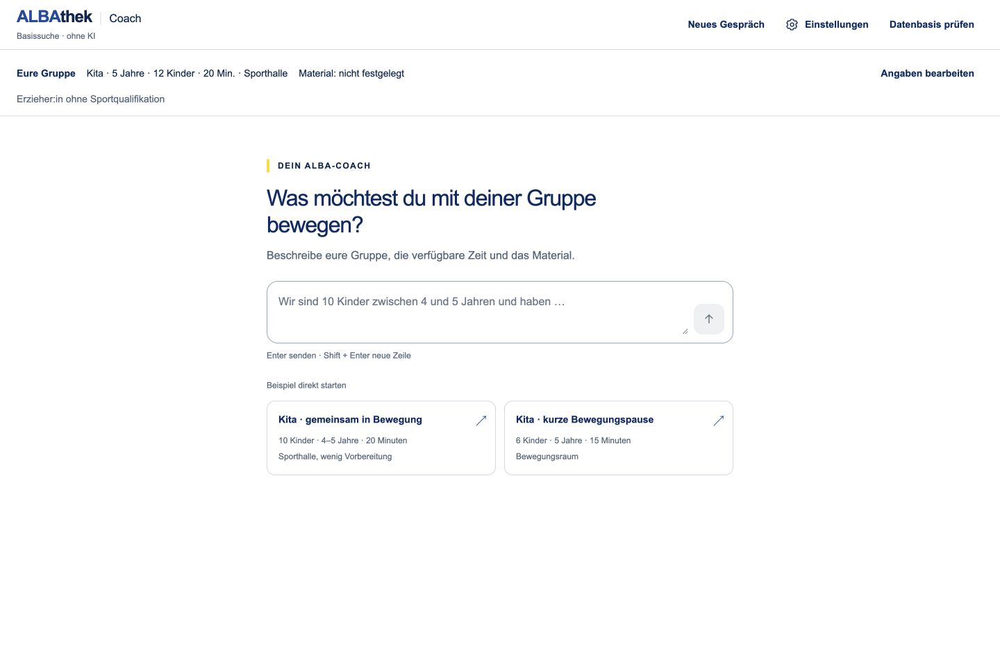
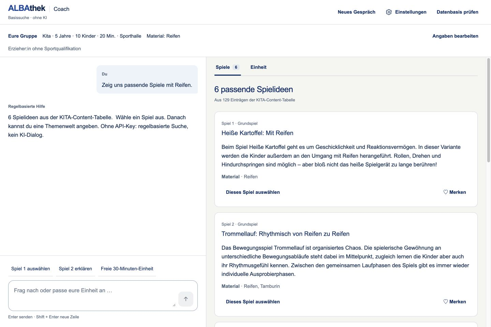
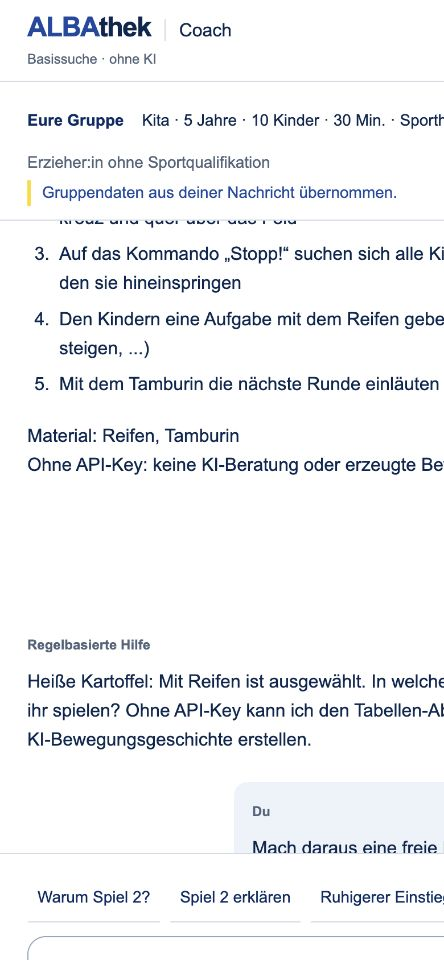
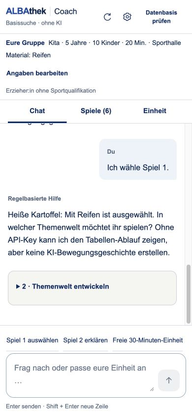
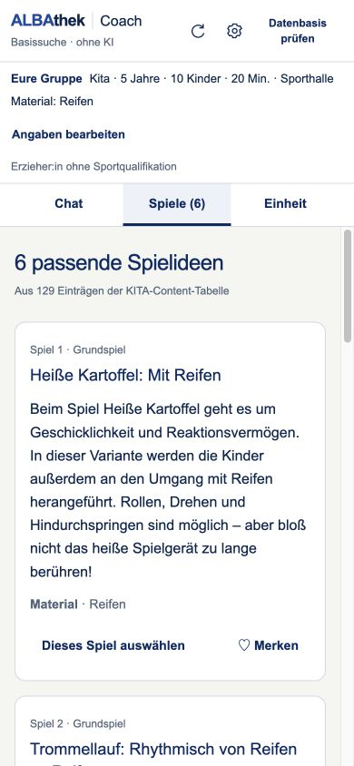
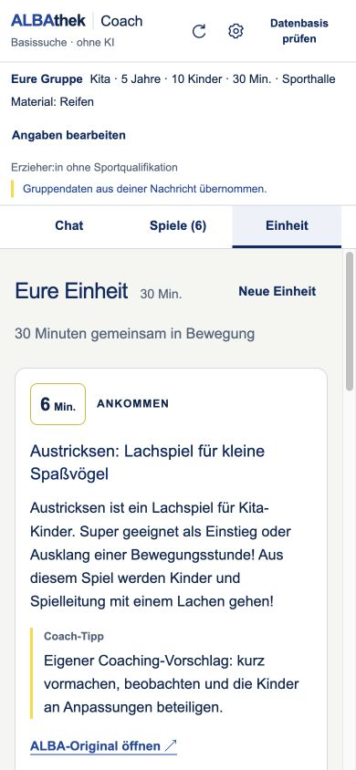
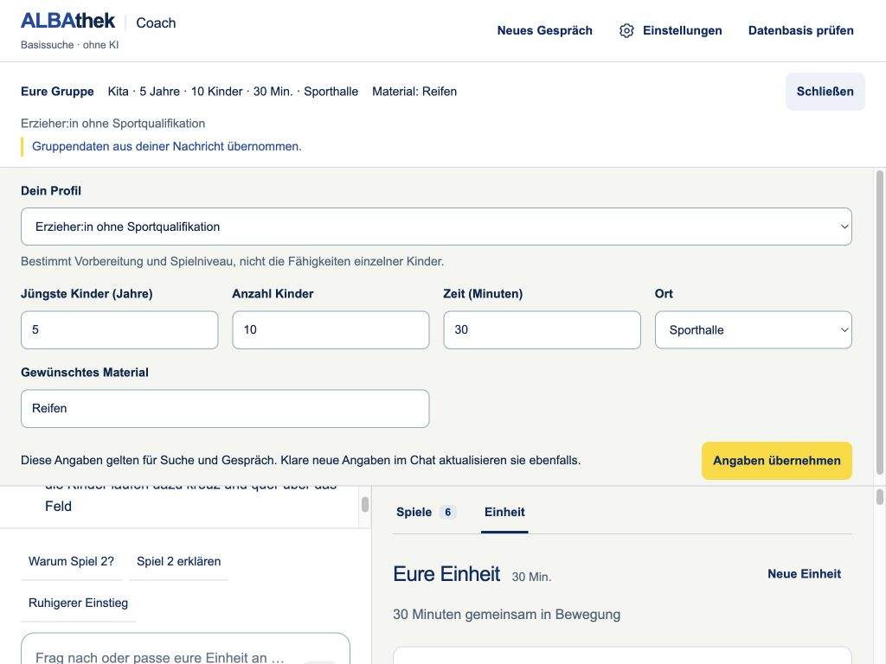

# KITA-Coach zuerst · UI-Prüfung 23.09.2026

## Umfang

Direkter Coach-Einstieg statt Startseite plus Modal. Profil und Gruppendaten werden ausschließlich im Coach bearbeitet. Chat, Treffer und optionale Datenprüfung lesen denselben Sitzungsstand. Das Formular übernimmt explizite Angaben, verwirft veralteten Provider-Kontext und prüft Treffer neu; bestehende Planstände und Nachrichten bleiben erhalten. Der nächste KI-Aufruf enthält die aktuellen Gruppendaten.

Eine Formularänderung startet keine KI-Anfrage. Beim Senden zeigt der Chat die tatsächlichen Statusereignisse des unveränderten Endpunkts. Währenddessen bleiben Abbruch und lokale Vorauswahl sichtbar. Unvollständige KI-Anfragen lassen die Vorauswahl als solche gekennzeichnet. Keine simulierte Prozentanzeige, keine neue Such- oder Persona-Regel.

Spielkarten ohne Bild haben volle Titelbreite. Antworten erhalten sichere Textabsätze und echte Listen, ohne HTML-Ausführung. Die Themenwelt ist Teil des scrollbaren Gesprächs statt eines großen festen Blocks über der Eingabe.

## Prüfungen

- 34 automatisierte Tests: bisherige 30 plus Formular-/Chat-Kontext, Materialwechsel, unveränderte Sitzungsdaten und Textformatierung.
- Browser, lokale Basissuche: Formular auf 10 Kinder/Reifen ändern → Suche → sechs Treffer → Spiel 2 erklären → Neuladen erhält Gruppe und Dialog → Spiel 1 auswählen → freie 30-Minuten-Einheit auf ausdrücklichen Wunsch.
- Datenbasis zeigt weiterhin alle 129 Einträge; Rückkehr zum Coach erhält Gespräch und Einheit.
- Visuell geprüft: 1440 × 960, 1024 × 768, 390 × 844 und 320 × 740. Kein abgeschnittener schmaler Titel bei Spielen ohne Bild. Themenwelt auf kleinen Ansichten einklappbar und mit dem Gespräch scrollbar.
- ESLint, App-TypeScript und beide Produktionsbuilds erfolgreich.

Grenzen: Browserprüfung ohne OpenAI-Key. Gestreamte API-Verarbeitung, Authentifizierungsfehler und Planvalidierung werden mit kontrollierten API-Antworten getestet; echte Antwortqualität und Wartezeiten wurden in dieser UI-Runde nicht erneut gemessen. Physische Bildschirmtastatur, vollständige Screenreader-Prüfung und 200-%-Browserzoom wurden nicht separat abgenommen.

## Veröffentlichung

Geschützte [KITA-Testvorschau](https://kita-personas-test--albathek-match.netlify.app), Netlify-Entwurf vom 23.09.2026: `6ab37ab0cfac9712d8c81d5d`. Die Produktion bleibt unverändert. Zugangsschutz für Seite, Coach-Endpunkt und Bild ohne Anmeldung mit HTTP 401 geprüft; angemeldeter Seitenabruf mit HTTP 200 und privater No-Store-Cache-Regel. Passwort und OpenAI-Schlüssel sind nicht Bestandteil dieses Repositorys.

## Aufnahmen

### Desktop

### Mobil

### Angaben bearbeiten

